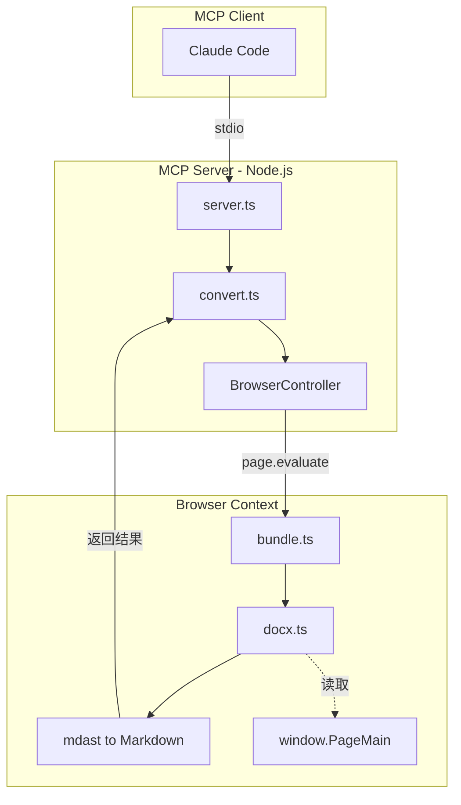
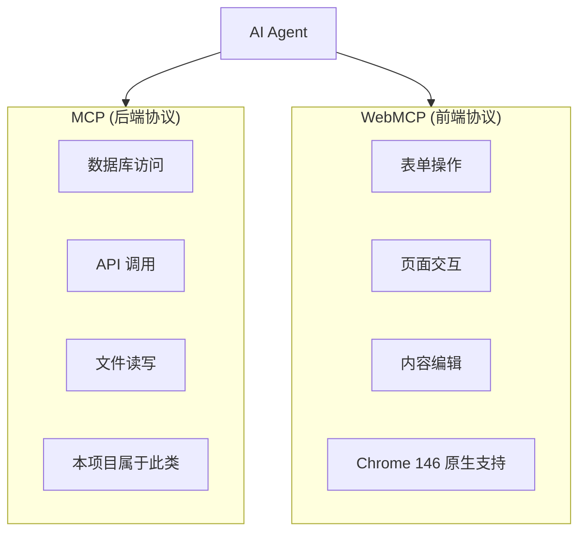

# 飞书文档转 Markdown MCP 实现方式

## 项目概述

**feishu-to-md-mcp** 是一个基于 MCP（Model Context Protocol）的飞书/Lark 文档转换工具，通过浏览器自动化技术将飞书文档转换为标准 Markdown 格式。

### 核心价值

- 让 AI 助手（如 Claude）能够直接读取飞书文档内容
- 保留文档结构、图片、附件等完整信息
- 无需飞书 API 权限，通过浏览器模拟用户操作

---

## 使用方式

### 1. npm 全局安装

```bash
npm install -g feishu-to-md-mcp
```

### 2. 配置到 Claude Code

在 Claude Code 的 MCP 配置文件中添加：

```json
{
  "mcpServers": {
    "feishu-to-md": {
      "command": "feishu-to-md-mcp"
    }
  }
}
```

### 3. 使用示例

在 Claude Code 中直接调用：

```
请帮我转换这个飞书文档：https://example.feishu.cn/docx/xxxxx
```

### 输出结构

```
output/
├── 文档标题.md      # Markdown 文件
├── images/          # 图片资源
│   ├── token1.png
│   └── token2.jpg
└── files/           # 附件文件
    └── report.pdf
```

---

## 技术架构

### 整体架构图



### 双产物构建

项目通过 **tsup** 构建两个独立的产物：

| 产物 | 格式 | 用途 | 运行环境 |
|------|------|------|----------|
| `dist/index.js` | ESM | MCP 服务器入口 | Node.js |
| `dist/browser-injected.js` | IIFE | 注入浏览器页面 | Browser |

```typescript
// tsup.config.ts 核心配置
export default defineConfig([
  // Node.js MCP 服务器
  { entry: { index: 'src/index.ts' }, format: ['esm'] },

  // 浏览器注入脚本 - 必须自包含所有依赖
  {
    entry: { 'browser-injected': 'src/browser/bundle.ts' },
    format: ['iife'],
    platform: 'browser',
    noExternal: [/.*/],  // 打包所有依赖
  },
])
```

**为什么需要 IIFE 产物？**

飞书文档的内部 API（`window.PageMain`）仅在浏览器上下文中可用。通过 `page.evaluate()` 注入 IIFE 脚本，可以访问这些全局变量并提取文档数据。

---

## 核心技术点

### 1. 浏览器自动化模式

#### 启动模式

Playwright 启动独立浏览器实例，使用隔离的用户数据目录：

```typescript
// 每种浏览器使用独立 profile
const userDataDir = path.join(homeDir, '.feishu-mcp', 'browser-data', browserType)

// 启动持久化上下文（保留登录状态）
this.context = await chromium.launchPersistentContext(userDataDir, {
  headless: false,
  channel: 'chrome',  // 或 'msedge', 'chromium'
})
```

#### CDP 模式

连接到已运行的浏览器，复用已认证的会话：

```typescript
// 用户启动浏览器时需开启远程调试
// Chrome: --remote-debugging-port=9222

const browser = await chromium.connectOverCDP('http://localhost:9222')
const context = browser.contexts()[0]  // 复用现有上下文
```

**CDP 模式优势：**
- 无需重新登录
- 可复用已有标签页
- 转换后不关闭浏览器

### 2. 文档数据提取

飞书文档采用 Block 模型，每个段落、图片、表格都是一个 Block：

```typescript
// 飞书 Block 类型枚举（部分）
enum BlockType {
  PAGE = 'page',        // 文档根节点
  TEXT = 'text',        // 文本段落
  HEADING1 = 'heading1', // 标题
  CODE = 'code',        // 代码块
  IMAGE = 'image',      // 图片
  TABLE = 'table',      // 表格
  FILE = 'file',        // 附件
  // ... 更多类型
}
```

**提取流程：**

```typescript
// 1. 等待文档加载完成
await page.waitForFunction(() => {
  return window.PageMain?.blockManager?.rootBlockModel !== undefined
})

// 2. 注入转换脚本
const result = await page.evaluate(async (script) => {
  eval(script)  // 执行 IIFE bundle

  // 调用转换函数
  return await window.__feishuConverter.convertToMarkdown()
}, converterScript)
```

### 3. Markdown AST 转换

使用 **mdast**（Markdown Abstract Syntax Tree）进行结构化转换：

```
飞书 Block → mdast Node → Markdown String
```

```typescript
// docx.ts 核心转换逻辑
class Transformer {
  // 将飞书 Block 转换为 mdast 节点
  transform(block: Block): mdast.Nodes {
    switch (block.type) {
      case BlockType.HEADING1:
        return { type: 'heading', depth: 1, children: [...] }
      case BlockType.CODE:
        return { type: 'code', lang: block.language, value: '...' }
      case BlockType.IMAGE:
        return { type: 'image', url: 'images/xxx.png' }
      // ...
    }
  }
}

// mdast → Markdown 字符串
import { toMarkdown } from 'mdast-util-to-markdown'
const markdown = toMarkdown(ast, {
  extensions: [
    gfmStrikethroughToMarkdown,  // ~~删除线~~
    gfmTableToMarkdown,          // GFM 表格
    gfmTaskListItemToMarkdown,   // 任务列表
    mathToMarkdown,              // 数学公式
  ]
})
```

### 4. 图片与附件下载

图片和文件需要在浏览器上下文中下载（需要登录态），然后传输到 Node.js 写入磁盘：

```typescript
// bundle.ts - 浏览器上下文
async convertToMarkdown() {
  // 下载图片
  for (const image of result.images) {
    const response = await fetch(image.url, { credentials: 'include' })
    const buffer = await response.arrayBuffer()
    // 转换为可传输的数字数组
    attachments.push({
      name: `images/${token}.png`,
      data: Array.from(new Uint8Array(buffer))
    })
  }
}

// convert.ts - Node.js 上下文
for (const attachment of result.attachments) {
  await fs.writeFile(attachPath, Buffer.from(attachment.data))
}
```

---

## 技术难点与解决方案

### 难点 1：跨环境数据传递

**问题：** Node.js 无法直接访问浏览器中的飞书内部 API。

**方案：** 双产物构建 + `page.evaluate()` 注入。IIFE bundle 在浏览器上下文执行，通过返回值传递数据。

### 难点 2：登录态管理

**问题：** 飞书文档需要登录才能访问。

**方案：**
- **启动模式：** 使用 `launchPersistentContext` 保存登录状态
- **CDP 模式：** 连接用户已登录的浏览器

### 难点 3：复杂 Block 类型

**问题：** 飞书支持 40+ 种 Block 类型，转换逻辑复杂。

**方案：**
- 使用策略模式，每种 Block 对应一个处理器
- mdast 中间层解耦转换与序列化
- 参考 [cloud-document-converter](https://github.com/whale4113/cloud-document-converter) 的实现

---

## 总结

本项目展示了如何通过浏览器自动化技术，绕过 API 限制实现飞书文档的完整转换。核心思路：

1. **MCP 协议** - 标准化工具接口，让 AI 助手直接调用
2. **Playwright 自动化** - 模拟用户操作，处理登录认证
3. **双产物构建** - 分离 Node.js 服务端与浏览器端代码
4. **mdast 抽象层** - 结构化转换，支持丰富的 Markdown 扩展语法

---

## 展望：Chrome 146 WebMCP 原生支持

### 什么是 WebMCP？

2026 年 3 月，Google 在 **Chrome 146** 引入 **WebMCP（Web Model Context Protocol）** 协议，这是一个革命性的变化：浏览器将原生支持 MCP，网站可以主动暴露结构化工具接口给 AI Agent。

### 当前方案的局限性

本项目采用 Playwright 浏览器自动化 + 内部 API 读取：

```
AI Agent → Playwright 注入脚本 → 读取 window.PageMain → Block 数据转换 → Markdown
```

这种方式的优势是**结构化数据读取**，避免了视觉识别的开销。但仍存在局限：
- **依赖内部 API**：`window.PageMain` 是飞书未公开的内部接口，可能随版本变化
- **需要浏览器环境**：必须启动真实浏览器，无法在纯 Node.js 环境运行
- **登录态管理**：需要处理用户认证，增加了使用复杂度

相比之下，Computer Use 方案（截图识别）的问题更严重：
- **慢**：截图、传输、识别耗时，简单操作可能需要 10 秒以上
- **贵**：截图识别消耗大量 Token
- **脆**：网页改版、样式变化都可能导致失效

### WebMCP 带来的改变

WebMCP 让网站从"被动被抓取"变成"主动暴露能力"：

```html
<!-- 网站只需添加 MCP 属性 -->
<form mcp-action="search" mcp-description="搜索飞书文档">
  <input name="query" mcp-param="搜索关键词">
  <button type="submit">搜索</button>
</form>
```

AI Agent 可以直接调用 `search` 工具，无需截图识别：

```
AI Agent → 直接调用结构化接口 → 网站响应
```

### MCP + WebMCP：前后端双层架构



### 对本项目的影响

**短期（现在）：** 本项目仍是飞书文档转换的最佳方案，因为：
- 飞书尚未支持 WebMCP
- WebMCP 刚进入早期预览阶段

**中长期（Chrome 146 稳定后）：** 架构可能简化：

| 组件 | 当前方案 | WebMCP 后 |
|------|----------|-----------|
| 浏览器连接 | Playwright 自动化 | Chrome 原生 MCP 连接 |
| 文档转换逻辑 | 读取 `window.PageMain` → Block → mdast | **不变，逻辑相同** |
| 依赖 | playwright + 浏览器安装 | 仅需 Chrome 浏览器 |

**核心洞察：** WebMCP 改变的是"如何连接浏览器"，而不是"如何转换文档"。

本项目的文档转换逻辑（Block 解析、mdast 生成、Markdown 序列化）仍然有效，只是不再需要 Playwright 作为中间层，可以：
1. 将转换逻辑注册为 WebMCP 工具
2. AI Agent 直接通过 Chrome 原生接口调用
3. 减少 Playwright 依赖，降低部署复杂度

### 开发者行动建议

1. **现在**：在 Chrome Canary 中启用 WebMCP 测试
   ```
   chrome://flags → 启用 "WebMCP for testing"
   ```

2. **评估**：思考产品的哪些操作适合暴露为 MCP 工具

3. **准备**：从 Declarative API 入手，在现有表单上添加 MCP 属性

### 参考资料

- [Chrome WebMCP 官方文档](https://developer.chrome.com/docs/web-platform/webmcp/)
- [Chrome WebMCP：浏览器变成 AI Agent 工具箱](https://zhuanlan.zhihu.com/p/2012637639929508688)
- [Model Context Protocol](https://modelcontextprotocol.io/)
- [Playwright Documentation](https://playwright.dev/)
- [mdast - Markdown Abstract Syntax Tree](https://github.com/syntax-tree/mdast)
- [cloud-document-converter](https://github.com/whale4113/cloud-document-converter)
