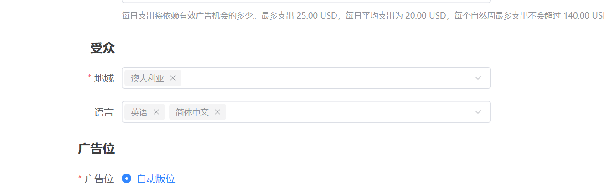
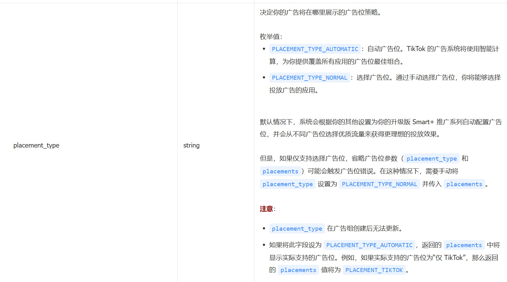
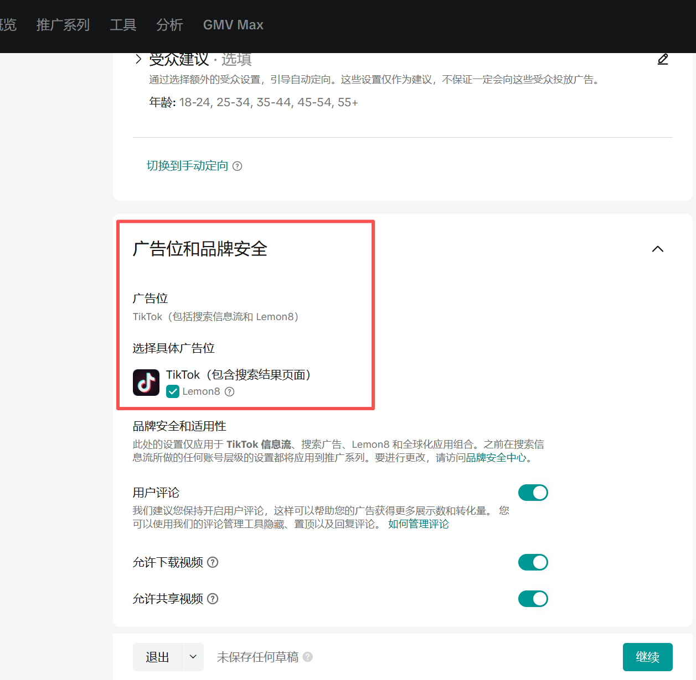
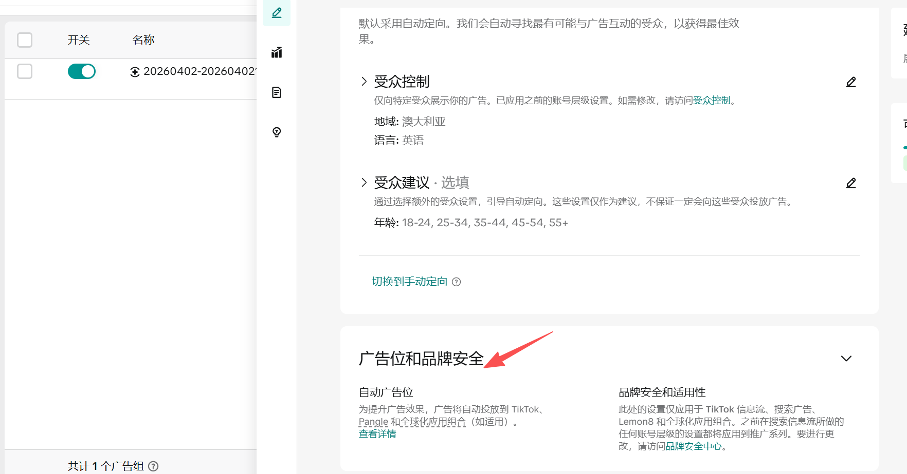
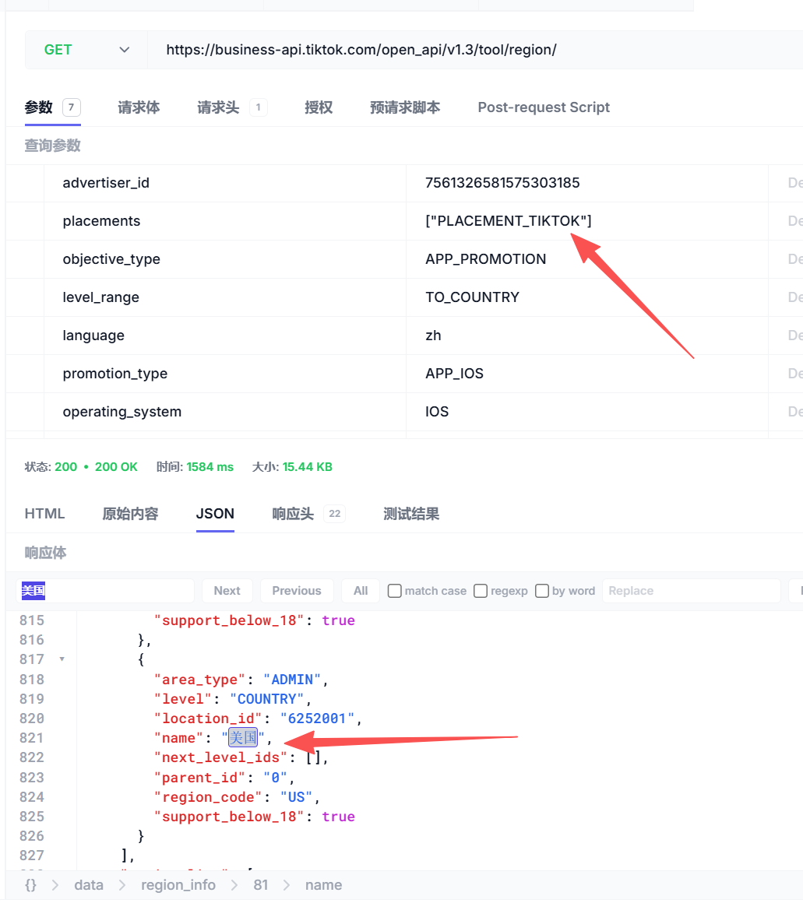
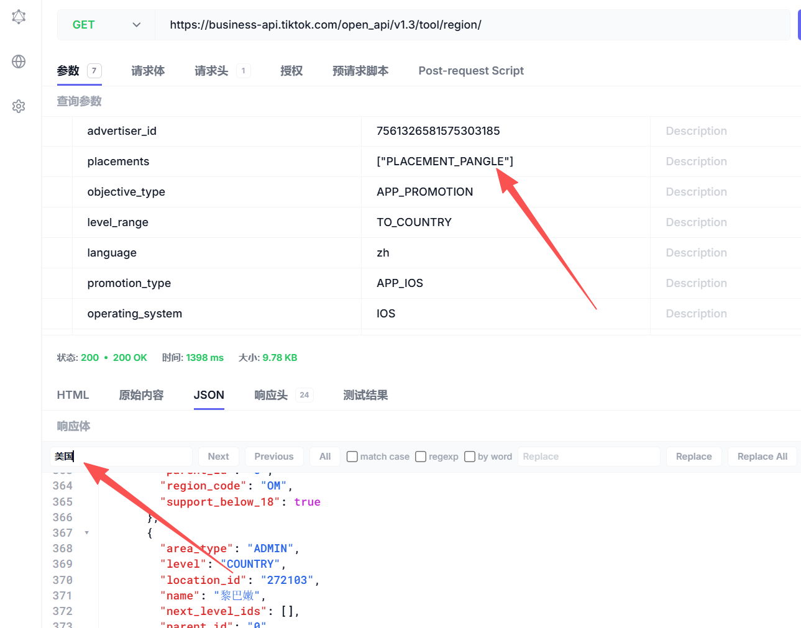

# 问题发生

在创建广告组时，如果受众中的地域选择的是美国和英国（选择其他的没问题），并且广告位选择的是自动版位的话，会导致广告组创建失败，报错如下：

{"code":40002,"message":"Invalid Param(s): 'placement\_type'. The placement\_type only supports 'PLACEMENT\_TYPE\_NORMAL'.","request\_id":"20260402164738696E037A0B6EF5E5DDA5"}

表示版位类型只能选择手动版位，而不能选择自动版位，但是在接口字段的说明中没有任何体现

相反，在api文档中还可以看到，smart+推广系列只能使用自动版位，而不能使用手动版位，smart+应该是做过升级。可以使用手动版位

# 排查过程

在tiktok页面上手动创建推广系列和广告组时可以看到，tiktok线上的界面已经不支持自动版位了

但是通过我们系统创建成功的广告组还是可以看到这里的版位为自动版位，并且手动加上美国英国后也是可以的

通过获取地域的接口获取可用地区之后可以发现，目前美国只能在tiktok版位投放，无法在pangle和全球化应用组合版位投放

因此得出结论是tiktok内部对版位的逻辑管理混乱

# 解决方案

和产品同学沟通过之后，smart+是必须用自动版位的，不能切手动版位，因此这个问题先作为已知问题继续开发，这个问题向tiktok提工单进行沟通，等待tiktok的回复。
