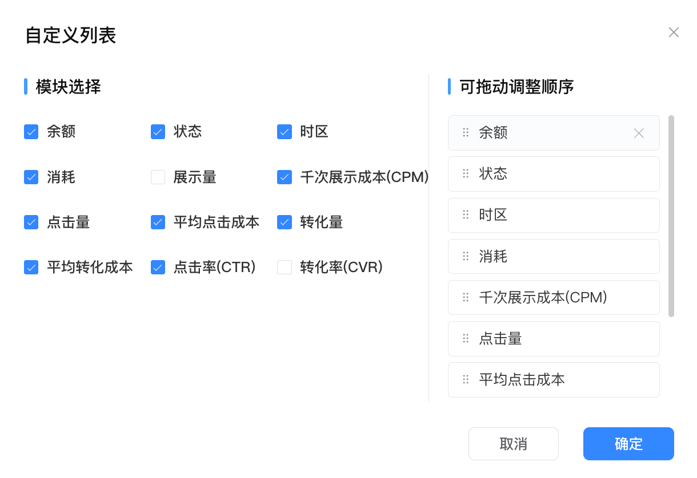

&#x20;

## 零、业务需求与场景

**1、痛点：**

当前代投客户数据报表采用人工线下导出模式，存在以下问题：

* 效率问题：人工每日导数耗时耗力，响应周期长，业务增长直接受限于人力投入

* 体验问题：人工导数模式缺乏专业性，已造成多个商机流失

* 风险问题：人工操作易出错，数据口径不统一

**2、解决方案：**

通过系统化报表模块，实现数据自动化、标准化，提升客户体验，支撑业务规模化增长。

**3、核心概念说明：**

| **核心概念**    | **定义**                          | **英文**              | **说明**                               |
| ----------- | ------------------------------- | ------------------- | ------------------------------------ |
| 广告主         | 放广告的商家，如Shopee、Shein等           | Advertiser          | 一个广告主可以发布多个Offer                     |
| Offer       | 广告主发起的推广计划，每个Offer有独立的推广链接和佣金规则 | Offer               | 个广告主可以发布多个Offer，每个Offer对应一个唯一的推广Link |
| Sub ID      | 追踪链接中的特殊标识                      | Sub ID              | 一个Offer会产生多个Sub ID                   |
| 订单          | 用户点击推广链接后产生的购买订单           | Order               |                                      |
| 商品          | 订单中购买的具体商品                      | Product/Item        | 一个订单可以包含多个商品                         |
| 代投/客户  | 推广渠道方，负责将Offer推广链接分发给目标用户       | Publisher/Affiliate |                                      |
| 用户          | 看广告的终端用户，广告主的投放对象               |                     |                                      |

## 一、报表架构

### 1.1 数据统计模块（2独立报表）

* 登录系统后，当前只有「数据统计」模块，下方有两个子模块

  * CPS表现：聚合数据分析，看趋势和效果对比

  * 订单统计：查看每笔订单详情，核对申诉

***

## 二、报表1：CPS表现报表

### 2.1 维度选择

* 默认只勾选日期

* 可多选：日期、广告主、Offer、Sub ID，这些维度可以自由组合，也可以全不选

* 如果上面选择了某一个维度，下方列表才会出现这个字段，否则列表就不展示这个字段

* 举例：

  * 选择了日期、广告主、Sub ID：每个Sub ID在某一天的CPS表现数据

  * 全不选：这个客户在这段时间内CPS表现数据汇总

### 2.2 筛选条件

#### 按日期维度

| 筛选项        | 默认值   | 说明                                                        |
| ---------- | ----- | --------------------------------------------------------- |
| 日期范围       | 近7天   |                                                           |
| 时区         | UTC+8 |                                                           |
| 广告主名称      | --    | 下拉展开为当前客户已经开启/参加的Offer所属广告组倒序，多选，支持输入搜索，模糊搜索（暂时先直接在库里面写入） |
| OfferID/名称 | --    | 下拉展开为当前客户已经开启/参加的Offer倒序，多选，支持输入搜索，模糊搜索（暂时先直接在库里面写入）      |
| Sub ID     | --    | 输入框模糊搜索，数据精确查询                                            |

**注意：**

* 广告主名称、OfferID/名称下拉选择框不需要有联动关系

### 2.3 汇总卡片（4个）

| 指标   | 计算公式            | 单位    | 说明                                |
| ---- | --------------- | ----- | --------------------------------- |
| GMV  | SUM(订单销售额)      | 固定USD | 总销售额，包含退款金额。鼠标悬浮显示提示「总销售额，包含退款金额」 |
| 佣金   | SUM(佣金额)        | 固定USD | 总用金额，不用管批准和拒绝的状态                  |
| 订单数  | COUNT(Order ID) | 个     | 订单总数，不区分订单状态（包含所有状态的订单）           |
| 退款金额 | SUM(退款金额)       | 固定USD | 是订单的总退款金额                         |

### 2.4 数据表格字段

#### 按日期维度

| 字段           | 排序 | 默认显示    | 计算公式/说明                         | 单位       |
| ------------ | -- | ------- | ------------------------------- | -------- |
| 日期           | ❌  | 维度选择才显示 | 每天一行数据，需跟上面的时区进行对应，默认按照时间倒序排列   | -        |
| OfferID      | ❌  | 维度选择才显示 | Offer唯一标识，固定展示                  | -        |
| Offer名称      | ❌  | 维度选择才显示 | Offer名称                         | -        |
| 广告主名称        | ❌  | 维度选择才显示 | 广告主名称                           | -        |
| Sub ID       | ❌  | 维度选择才显示 | 追踪的标识                           |          |
| 点击数          | ✅  | ❌       | 点击汇总，如果从广告主获取不到，空着即可            | 次        |
| 订单数          | ✅  | ✅       | COUNT(Order ID)，每天的订单汇总，不区分订单状态 | 个        |
| 待确认订单数       | ✅  | ❌       | 统计当前广告主侧需要确认的订单数（pending）       | 个        |
| 已批准订单数       | ✅  | ❌       | 统计当前广告主侧已经批准的订单数（approved）      | 个        |
| 被拒绝订单数       | ✅  | ❌       | 统计当前广告主侧已经拒绝的订单数（declined）      | 个        |
| 退单数          | ✅  | ❌       | 退单数：只要有子订单退了，就算这一单被退掉了          | 个        |
| 退单率          | ✅  | ❌       | 退单数 / 订单数 x 100%                | %，保留两位   |
| 转化率          | ✅  | ❌       | 订单数 / 点击数 × 100%，如果获取不到点击数则为空值  | %，保留两位   |
| GMV(USD)     | ✅  | ✅       | SUM(订单销售额)，的总销售额，包含退款金额         | USD，保留两位 |
| 客单价(USD)     | ✅  | ✅       | GMV / 订单数，保留2位小数                | USD，保留两位 |
| 退款金额(USD)    | ✅  | ✅       | 总退款金额，单位USD                     |          |
| 佣金(USD)      | ✅  | ✅       | SUM(佣金额)，返回的佣金总额                | USD，保留两位 |
| 待确认佣金金额(USD) | ✅  | ❌       | 返回的的当前广告主侧需要确认的订单佣金（pending）    | USD，保留两位 |
| 已批准佣金金额(USD) | ✅  | ❌       | 返回的的当前广告主侧需要批准的订单佣金（approved）   | USD，保留两位 |
| 被拒绝佣金金额(USD) | ✅  | ❌       | 统计当前广告主侧已经拒绝的订单佣金（declined）     | USD，保留两位 |
| 每次点击收益(USD)  | ✅  | ❌       | 总佣金/点击数，如果无点击数，此字段为空值           | USD，保留两位 |
| 新用户数         | ✅  | ❌       | 新用户数量（首次下单的用户），如果获取不到点击数则为空值    | 个        |
| 老用户数         | ✅  | ❌       | 老用户数量（非首次下单的用户），如果获取不到点击数则为空值   | 个        |

**列表排序：**

默认，日期优先级>广告主优先级>Offer优先级>Sub ID优先级

### 2.5 自定义列功能

**功能说明**：

* 交互样式参考SmartBrand的设计，支持拖拽调整字段顺序

* 根据维度选择，固定显示：日期、OfferID、Offer名称、广告主名称、Sub ID，这些字段不会出现在自定义列表

* 默认展示字段：订单数、GMV、客单价、佣金、退款金额

* 所有可选字段：点击数、订单数、待确认订单数、已批准订单数、被拒绝订单数、退单数、退单率、转化率、GMV、客单价、佣金、待确认佣金金额、已批准佣金金额、被拒绝佣金金额、退款金额、每次点击收益、新用户数、老用户数

* 最多可以选全部，最少选择1个

* 配置保存在浏览器本地存储，下次访问时保持

### 2.6 功能特性

**字段关系**

* 订单数=待确认+已批准+被拒绝

* 佣金=待确认佣金+已批准佣金（也就是最终我们结算的佣金）+被拒绝佣金

**排序**

* 都支持排序

* 数值类点击排序按键，先升序，后降序，再复原

* 时间类点击排序按键，先正序，后倒序，再复原

* 如果为空值，不参与排序，一直放在最后即可

**分页**

* 默认每页10条，支持切换10/30/50/100

**导出**

* 导出当前筛选条件下、所选维度下、所选字段下的所有数据

* 格式：Excel (.xlsx)

* 文件名：CPS表现报表\_YYYYMMDD\_HHmmss.xlsx

* 下载时有loading状态，只有上一张表下载完才能再次下载

***

## 三、报表2：订单报表

### 3.1 筛选条件

| 筛选项        | 默认值   | 说明                                                   |
| ---------- | ----- | ---------------------------------------------------- |
| 日期范围       | 近7天   |                                                      |
| 时区         | UTC+8 |                                                      |
| 订单ID       | --    | 模糊搜索选项，精确搜索结果                                        |
| 订单结算状态     | --    | 下拉多选，可选项为：待确认、已批准、被拒绝                                |
| 订单状态       | --    | 下拉单选，可选项为：正常，退单                                      |
| 子订单ID      | --    | 模糊搜索选项，精确搜索结果                                        |
| 商品ID/名称    | --    | 糊搜索选项，精确搜索结果                                         |
| 店铺ID/名称    | --    | 模糊搜索选项，精确搜索结果                                        |
| Sub ID     | --    | 模糊搜索选项，精确搜索结果                                        |
| OfferID/名称 | --    | 下拉展开为当前客户已经开启/参加的Offer倒序，多选，支持输入搜索，模糊搜索（暂时先直接在库里面写入） |
| 广告主名称      | --    | 下拉展开为当前客户已经开启/参加的Offer的广告主倒序，多选，支持输入搜索（暂时先直接在库里面写入）  |

**注意**：

* 多的筛选项收起即可

### 3.2 汇总信息（4个）

GMV、佣金、订单数、退款金额——同上

### 3.3 数据表格结构

**表格采用两层展示结构：**

#### 第一层：订单层（默认显示）

每个订单占一行，显示订单级别的汇总信息。左侧有展开/收起按钮。

| 字段        | 排序 | 默认显示 | 说明                            |
| --------- | -- | ---- | ----------------------------- |
| 展开/收起     | ❌  | --   | 点击展开查看该订单的商品明细，下钻功能关闭时不显示     |
| 订单ID      | ❌  | 固定展示 | 订单唯一标识，固定展示                   |
| 订单创建时间    | ✅  | ✅    | 订单创建时间，格式：YYYY-MM-DD HH:mm:ss |
| 订单完成时间    | ✅  | ❌    | 订单完成时间，格式：YYYY-MM-DD HH:mm:ss |
| 订单结算状态    | ❌  | ✅    | 订单结算状态：待确认、已批准、被拒绝            |
| 订单状态      | ❌  | ✅    | 订单状态：正常、退单                    |
| GMV(USD)  | ✅  | ✅    | 订单金额                          |
| 退款金额(USD) | ✅  | ❌    | 该订单的退款金额，单位USD                |
| 佣金(USD)   | ✅  | ✅    | 订单总佣金                         |
| 国家        | ❌  | ❌    | 订单所属国家，这个字段不一定能获取到，不能的话就不展示   |
| Sub ID    | ❌  | ❌    | 来自哪个追踪链接                      |
| OfferID   | ❌  | ❌    | 来自哪个Offer，Offer唯一标识           |
| Offer名称   | ❌  | ❌    | 来自哪个Offer                     |
| 广告主名称     | ❌  | ❌    | 来自哪个广告主                       |

**注意：**

1. 列表排序：按照订单创建时间倒序

#### 第二层：商品层（展开后显示）

点击订单行的展开按钮后，在该订单下方显示商品明细，每个商品占一行。

| 字段          | 默认显示 | 说明                  |
| ----------- | ---- | ------------------- |
| 子订单ID       | 固定展示 | 订单项唯一标识，固定展示        |
| 商品名称        | ✅    | 商品完整名称              |
| SKU         | ✅    | 商品SKU编码，用于唯一标识商品规格  |
| 商品ID        | ✅    | 商品唯一标识              |
| 商品实际付款(USD) | ✅    | 该商品的实际付款金额，单位USD    |
| 下单件数        | ✅    | 用户购买的商品总数量          |
| 退货件数        | ❌    | 该商品已退货的数量（可以小于下单件数） |
| 退款金额(USD)   | ❌    | 该商品已退款的金额，单位USD     |
| 店铺ID        | ❌    | 店铺唯一标识              |
| 店铺名称        | ❌    | 店铺名称                |

### 3.4 自定义列表功能

1. **下钻功能开关**（顶部）：

   * 开启：默认开启，显示展开按钮，可以下钻查看商品明细，右侧商品明细字段配置可用

   * 关闭：只显示订单层数据，不显示展开按钮，右侧商品明细字段配置置灰不可用

2. **订单列表：**

* 必选字段：订单ID

* 默认勾选：订单创建时间、订单结算状态、订单状态、GMV、佣金

* 所有可选字段：订单创建时间、订单完成时间、订单结算状态、订单状态、GMV、退款金额、佣金、国家、Sub ID、OfferID、Offer名称、广告主名称

* 其余功能同上

- **商品明细：**

* 必选字段：子订单ID

* 默认勾选：商品名称、SKU、商品ID、商品实际付款、下单件数

* 所有可选字段：商品名称、SKU、商品ID、商品实际付款、下单件数、退货件数、退款金额、店铺ID、店铺名称

* 其余功能同上

### 3.5 功能特性

**下钻展开**

* 当下钻功能开启时，默认显示订单层，每个订单占一行

* 点击订单行左侧的"+"按钮，展开显示该订单的商品明细

* 点击"-"按钮，收起商品明细

* 商品明细行使用缩进或不同背景色区分

* 支持展开多个订单同时查看

**排序**

* 仅订单层支持排序，商品层按订单内的顺序显示，不支持独立排序

* 支持排序的字段：订单创建时间、订单完成时间、GMV、退款金额、佣金

**分页**

* 按订单数量分页（不是按商品数量）

* 每页10条订单，支持切换10/30/50/100

* 展开的商品明细不计入分页数量

**导出**

* 导出时采用平铺展开格式，每个商品占一行

* 订单信息会在每个商品行中重复显示

* 导出字段包含：订单层所有选中的字段 + 商品层所有选中的字段

* 格式：Excel (.xlsx)

* 文件名：订单报表\_YYYYMMDD\_HHmmss.xlsx

**导出示例**：

***

## 四、登录

参考云舟即可

账户：必须为邮箱

密码：大写、小写、数字和字符四选三，最低不能少于8位，字符包括“.-@/!,”，最多输入20个字符

